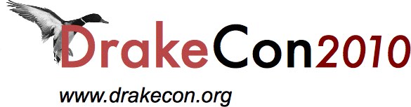

!SLIDE transition=fade center bullets

## Goodies ##

* [The Catalyst app this talk is based on:  http://versions.pgexperts.com/](http://versions.pgexperts.com/)
* [Its source:  pg-version-compare on github](http://github.com/qdw/pg-version-compare)
* [The slides for this talk:  http://bit.ly/noorm](http://bit.ly/noorm)
* [showoff, the app that made these slides:  showoff on github](http://github.com/schacon/showoff)

!SLIDE transition=fade center bullets

# Thanks! #

* Questions?

* Shameless plug:  [PostgreSQL Experts](http://pgexperts.com/) does Catalyst development.
David Wheeler and I are both consultants there.  [http://pgexperts.com/](http://pgexperts.com/)

!SLIDE transition=fade code

Copyright (c) 2010, Quinn Weaver
All rights reserved.

Redistribution and use in source and binary forms, with or without
modification, are permitted provided that the following conditions are met:

Redistributions of source code must retain the above copyright notice, this
list of conditions and the following disclaimer.

Redistributions in binary form must reproduce the above copyright notice, this
list of conditions and the following disclaimer in the documentation and/or
other materials provided with the distribution.

THIS SOFTWARE IS PROVIDED BY THE COPYRIGHT HOLDERS AND CONTRIBUTORS "AS IS"
AND ANY EXPRESS OR IMPLIED WARRANTIES, INCLUDING, BUT NOT LIMITED TO, THE
IMPLIED WARRANTIES OF MERCHANTABILITY AND FITNESS FOR A PARTICULAR PURPOSE ARE
DISCLAIMED. IN NO EVENT SHALL THE COPYRIGHT HOLDER OR CONTRIBUTORS BE LIABLE
FOR ANY DIRECT, INDIRECT, INCIDENTAL, SPECIAL, EXEMPLARY, OR CONSEQUENTIAL
DAMAGES (INCLUDING, BUT NOT LIMITED TO, PROCUREMENT OF SUBSTITUTE GOODS OR
SERVICES; LOSS OF USE, DATA, OR PROFITS; OR BUSINESS INTERRUPTION) HOWEVER
CAUSED AND ON ANY THEORY OF LIABILITY, WHETHER IN CONTRACT, STRICT LIABILITY,
OR TORT (INCLUDING NEGLIGENCE OR OTHERWISE) ARISING IN ANY WAY OUT OF THE USE
OF THIS SOFTWARE, EVEN IF ADVISED OF THE POSSIBILITY OF SUCH DAMAGE.
