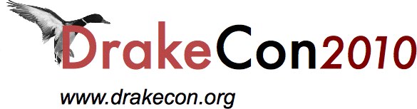

!SLIDE title-slide center

# Heretical Perl #

## Writing Catalyst Apps with No ORM ##

## by Quinn Weaver <<quinn@pgexperts.com>> ##

BSD-licensed.  See last slide for license text.

### Use the arrow keys to navigate.  This works in Chrome or Firefox (this is a [showoff](https://github.com/schacon/showoff) presentation). ###

!SLIDE transition=fade

# NoORM #

!SLIDE transition=fade

# YesSQL #

!SLIDE smbullets incremental

# About this talk #

## It has several purposes ##

* Motivation:  why not to use an ORM?

* Implementation:  how to do MVC basics without an ORM
* = essential nuts and bolts.

* Digression:  quick tours of some modules we use
* = optional, but may be useful.

* I'll try to be clear about which is which.

* If anything gets cut, it'll be the digressions.

!SLIDE smbullets incremental

# Preliminaries #

.notes There's lots of material.  We're going move quickly.  Please raise your hand if something is unclear; for longer questions, I'm leaving 15 minutes for Q&A.

* Show of hands:  how many people have used *some* ORM?

* How many people have been frustrated by that ORM?

* How many people have used a (web) MVC framework?

* How many people have never used Perl?  DBI?
